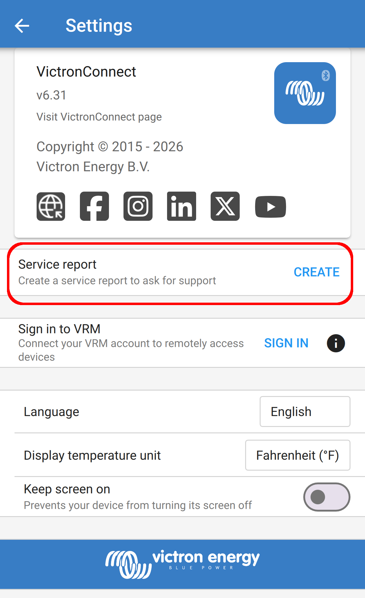

# Victron Connect Service Rereport Log Parser (vcsrlp)

Yes, the project name needs a re-work. I'm open to suggestions. 

A command-line tool for reading the binary "Service report" log files exported from the [VictronConnect](https://www.victronenergy.com/panel-systems-remote-monitoring/victronconnect) app.

One of my Victron MPPT controllers would not upgrade its firmware from v3.16 to v3.18 after dozens of attempts using the VictronConnect mobile app on my iPhone and iPad, via the VRM portal, uploading a local firmware file, nothing. It was suggested that I pull a "Service Report" from the app, but the output format was unreadable by any tools I had,

So I finally broke down and wrote this utility after spending way too long staring at a file my phone and laptop refused to read or open. Turns out the logs are zlib-compressed, which explains why every text editor and tool I used just shows binary garbage.

This script decompresses them and gives you something actually readable for debugging and troubleshooting.

---

## Background

When you tap **Send report** inside VictronConnect under the Settings menu, the app bundles up a `VictronConnect_report.log` file.



The name is a bit misleading — it's not a plain text log. The file has a 4-byte header followed by a zlib-compressed blob that, once unpacked, contains several named sections covering app diagnostics, a full event history, and a database of every device you've ever connected to.

This script handles all of that and lets you slice and dice the output by log level, module, time range, or a text search.

---

## Requirements

Python 3.7 or later. No third-party packages, everything used (`zlib`, `csv`, `argparse`, `re`, `datetime`) is in the Python core libraries.

---

## Installation

Clone this repository and just run it! 

```bash
git clone https://github.com/desrod/vcsrlp
chmod +x vcsrlp.py
```

Or clone the repo if you prefer:

```bash
git clone https://github.com/desrod/vcsrlp.git
cd vcsrlp
```


| Flag | Values | Description |
|------|--------|-------------|
| `--section` / `-s` | `header` `logs` `events` `products` `networking` `all` | Which section to display (default: `all`) |
| `--level` / `-l` | `DEBUG` `INFO` `WARN` `ERROR` | Filter log lines by severity |
| `--module` / `-m` | e.g. `FM`, `VRGTLR` | Filter log lines by internal module tag |
| `--since` | `YYYY-MM-DDTHH:MM:SS` | Show entries at or after this time |
| `--until` | `YYYY-MM-DDTHH:MM:SS` | Show entries up to and including this time |
| `--search` | any text | Case-insensitive substring filter |
| `--output` / `-o` | filepath | Write output to a file instead of stdout |
| `--summary` | — | Print a brief overview instead of full output |
| `--no-color` | — | Disable ANSI colour output |
| `--strict` | — | Fail if the decompressed size does not match the 4-byte length header |


---

## Usage

```
python3 vcsrlp.py <logfile> [options]
```

### Options

* `-s`, `--section` <header|logs|events|products|networking|all>
    Which section to display.
    Default: all

* `-l`, `--level` <DEBUG|INFO|WARN|ERROR>
    Filter log lines by severity.

* `-m`, `--module <tag>`
  Filter log lines by internal module tag. Example: FM, VRGTLR

* `--since <YYYY-MM-DDTHH:MM:SS>`
  Show entries at or after this time.

* `--until <YYYY-MM-DDTHH:MM:SS>`
  Show entries up to and including this time.

* `--search <text>`
  Case-insensitive substring filter.

* `-o`, `--output <filepath>`
        Write output to a file instead of stdout.

* `--summary`
    Print a brief overview instead of full output.

* `--no-color`
    Disable ANSI colour output.

* `--strict`
    Fail if the decompressed size does not match the 4-byte length header.
    Without it, a mismatch only prints a warning to stderr.

---

## Examples

### Summarize the Service Report log file:
```
./vcsrlp.py VictronConnect_report.log --summary
```
```
═══ VictronConnect Log Summary ══════════════════════
  App version   : v6.31
  Device        : iPhone17,1 iOS 18.7.3
  Log lines     : 43,297  (DEBUG=38650, INFO=4407, WARN=240)
  Events        : 1,570
  Known products: 4
  Event span    : 2024-06-22 → 2026-03-29
  Products:
    • Cerbo GX – Cerbo GX HQ231722MFN (serial HQ231722MFN)
    • SmartSolar Charger MPPT 100/20 48V – SmartSolar HQ23XXXXXXX (serial HQ23XXXXXXX)
    ...
```

#### Show only warnings and errors:
```
./vcsrlp.py VictronConnect_report.log --section logs --level WARN
```

### Filter to a specific module (e.g. the Firmware Manager):
```
./vcsrlp.py VictronConnect_report.log --module FM
```

### Look at what happened during a specific window:
```
./vcsrlp.py VictronConnect_report.log \
  --since 2026-03-29T18:37:00 \
  --until 2026-03-29T18:45:00
```

### Search for anything mentioning a specific device serial:
```
./vcsrlp.py VictronConnect_report.log --search HQ23XXXXXXX
```

### Dump everything to a plain text file (no colour codes):
```
./vcsrlp.py VictronConnect_report.log --output readable.txt --no-color
```

### See which devices are in the log:
```
./vcsrlp.py VictronConnect_report.log --section products
```

---

## File format

In case you want to build on this or write your own parser:

```
Offset 0-3   : uint32 big-endian (MSB-first) length, in BYTES, of the
               decompressed payload
Offset 4-end : zlib-compressed UTF-8 text
```

The 4-byte length prefix lets a streaming reader pre-size its output buffer and
lets you verify the file extracted intact. Note it counts **bytes** of the
decompressed payload, not characters — UTF-8 multibyte characters mean the
decoded character count is smaller. Pass `--strict` to turn a size mismatch
(truncated or corrupt file) into a hard error instead of a stderr warning.

The decompressed text is split into sections by banner lines:

```
=== SectionNameV01 ============...
```

| Section | Format | Contents |
|---------|--------|----------|
| `LogHeaderV01` | `Key: value` lines | App version, build info, device model, screen details |
| `LogLinesV01` | `LEVEL TIMESTAMP [MODULE] message` | Structured diagnostic log |
| `EventLogV01` | CSV | Full history of every user action and device interaction |
| `ProductDbV01` | Pipe-delimited table | Every device ever seen: name, custom name, PID, serial |
| `NetworkingDbV01` | Pipe-delimited table | Network/VRM identifiers |

The EventLog CSV columns are: `timestamp`, `app_version`, `serial`, `pid`, `event_type`, `path`, `old_value`, `new_value`.

---

## Using it as a library

The parser is importable if you want to process the data yourself:

```python
from vcsrlp import parse_log

log = parse_log("VictronConnect_report.log")

# App metadata
print(log.header.fields)

# All WARN-level log lines
warns = [l for l in log.log_lines if l.level == "WARN"]

# Events for a specific device
mppt_events = [e for e in log.events if "HQ2309JKGNF" in e.serial]
for ev in mppt_events:
    print(ev.timestamp_raw, ev.event_type, ev.path)

# Known products
for p in log.products:
    print(p.name, p.serial)
```

---

## Contributing

Bug reports and pull requests welcome. If your log file has sections this doesn't handle, open an issue and attach a sanitized copy (or at least paste the section header name) and I'll take a look.

---

## License

MIT